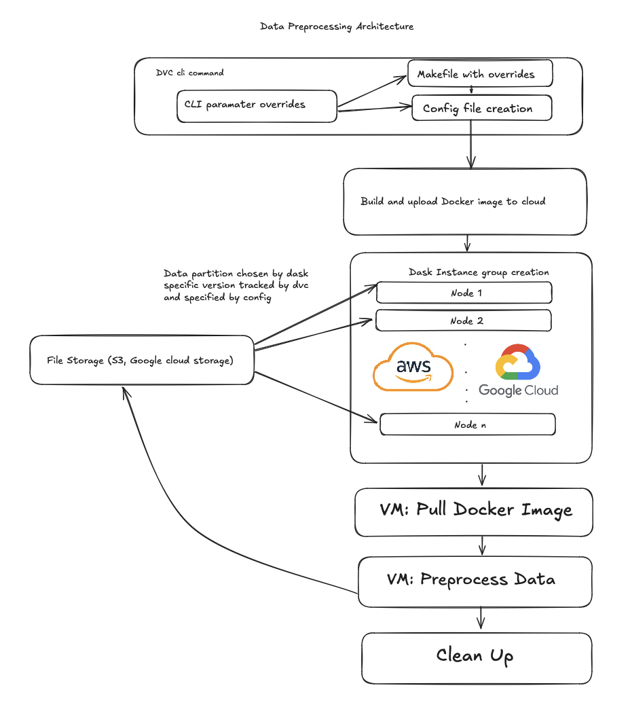
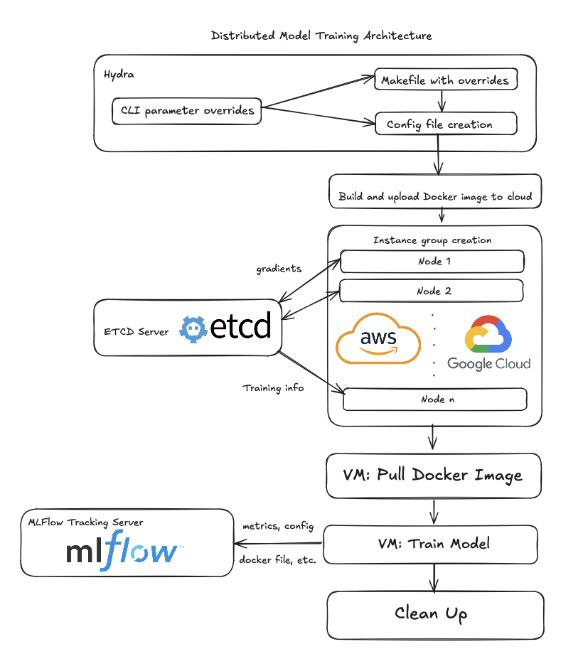
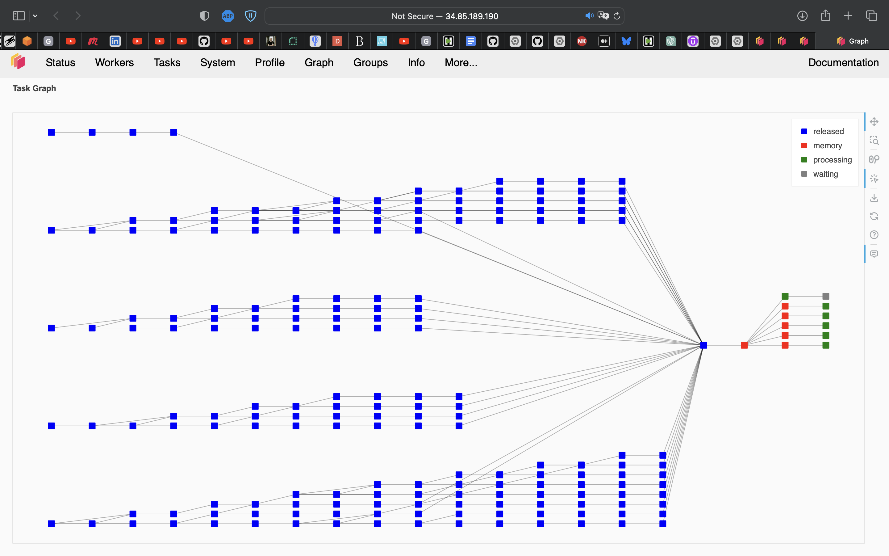
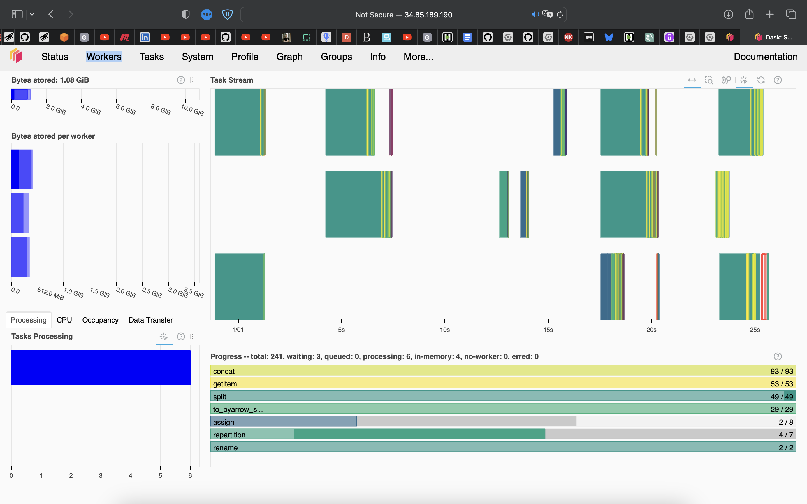
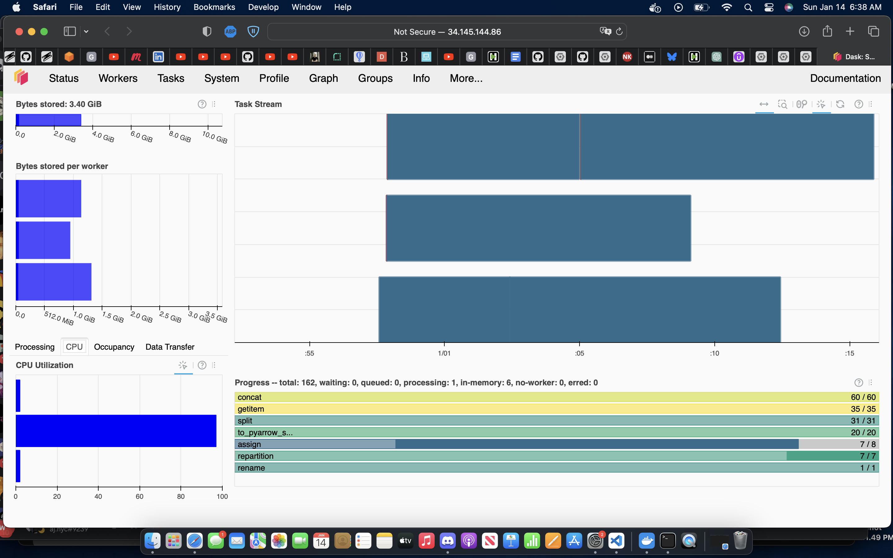

# cybulde-model: End-to-End Cyberbullying Detection

An end-to-end machine learning project for detecting cyberbullying in text, built with production ML engineering practices. This repo combines the **data preparation pipeline** (`cybulde-data-preparation`) and the **model training pipeline** into a single codebase.

---

## Architecture Overview

The system is composed of two major distributed pipelines, both running on Google Cloud Platform (GCP):

### Data Preparation Pipeline
Raw datasets from multiple sources → distributed preprocessing VMs → cleaned, versioned data in GCS



### Model Training Pipeline
Processed data → distributed training across GCP VMs → tracked experiments in MLflow



---

## Tech Stack

| Component | Technology |
|-----------|-----------|
| Model framework | PyTorch Lightning |
| Configuration | Hydra (structured configs) |
| Dependency management | Poetry |
| Containerization | Docker + docker-compose |
| Cloud infrastructure | GCP (Compute Engine VMs, Artifact Registry, GCS) |
| Experiment tracking | MLflow (PostgreSQL backend) |
| Data processing | Python (distributed across VMs) |
| Package tooling | pyproject.toml + setup.cfg |

---

## Repository Structure

```
cybulde-model/
│
├── cybulde/                        # Main Python package
│   ├── config_schemas/             # Hydra structured config dataclasses
│   │   ├── config_schema.py        # Root Config dataclass
│   │   ├── base_schemas.py         # Shared base types (TaskConfig, etc.)
│   │   ├── data_module_schemas.py  # DataModule config
│   │   ├── experiment/             # Per-experiment config compositions
│   │   ├── evaluation/             # Evaluation task/module configs
│   │   ├── infrastructure/         # GCP VM, MLflow, and network configs
│   │   ├── models/                 # Backbone, adapter, head configs
│   │   ├── trainer/                # Lightning Trainer, logger, callback configs
│   │   └── training/               # Loss, optimizer, scheduler, task configs
│   │
│   ├── configs/                    # Hydra config files
│   │   └── automatically_generated/  # Written by generate_final_config.py
│   │
│   ├── data_modules/               # Data pipeline code
│   │   ├── datasets.py             # PyTorch Dataset classes
│   │   └── data_modules.py         # PyTorch Lightning DataModules
│   │
│   ├── models/                     # Model definitions
│   │   ├── backbones.py            # HuggingFace transformer backbones
│   │   ├── adapters.py             # Adapter layers
│   │   ├── heads.py                # Classification heads
│   │   ├── models.py               # Assembled model classes
│   │   ├── transformations.py      # Tokenization transforms
│   │   └── common/                 # Shared model utilities (I/O, export)
│   │
│   ├── training/                   # Training pipeline
│   │   ├── tasks/                  # Training task classes (CommonTrainingTask, etc.)
│   │   ├── lightning_modules/      # LightningModule subclasses
│   │   ├── loss_functions.py
│   │   └── schedulers.py
│   │
│   ├── evaluation/                 # Evaluation pipeline
│   │   ├── tasks/                  # Evaluation task classes
│   │   ├── lightning_modules/      # Evaluation LightningModules
│   │   └── model_selector.py       # Selects best MLflow run for deployment
│   │
│   ├── infrastructure/             # GCP resource management
│   │   ├── instance_template_creator.py  # Creates GCE VM instance templates
│   │   └── instance_group_creator.py     # Creates managed instance groups
│   │
│   ├── utils/
│   │   ├── config_utils.py         # Hydra config loading helpers
│   │   ├── gcp_utils.py            # GCP API helpers
│   │   ├── io_utils.py             # File I/O helpers
│   │   ├── mlflow_utils.py         # MLflow context managers and logging
│   │   ├── torch_utils.py          # Distributed training helpers
│   │   ├── mixins.py               # LoggableParamsMixin, etc.
│   │   └── utils.py                # General utilities
│   │
│   ├── generate_final_config.py    # Pre-training: creates MLflow run, saves config
│   ├── launch_job_on_gcp.py        # Launches GCE managed instance group
│   └── run_tasks.py                # Training entrypoint (run via torchrun)
│
├── scripts/
│   ├── vm_startup/
│   │   └── task_runner_startup_script.sh  # GCE VM startup script
│   └── deploy-etcd-server.sh              # Deploy etcd for multi-node coordination
│
├── docker/
│   ├── Dockerfile                  # Container image
│   └── scripts/
│       ├── startup-script.sh       # Container entrypoint
│       └── start-tracking-server.sh  # Starts MLflow tracking server (dev mode)
│
├── .envs/                          # Environment variable files (not committed to git)
│   ├── .mlflow-common              # Shared MLflow settings (ports, artifact store)
│   ├── .mlflow-dev                 # Dev MLflow settings (local tracking URI)
│   ├── .mlflow-prod                # Prod MLflow settings (GCP internal URI)
│   └── .infrastructure             # GCP project, registry, VM settings
│
├── cybulde_artifacts/              # Architecture diagrams
├── mlruns/                         # Local MLflow data (reference only)
├── Makefile                        # Developer workflow commands
├── docker-compose.yaml             # Docker service definitions
├── pyproject.toml                  # Project metadata + Poetry dependencies
├── setup.cfg                       # Additional tool configuration
└── poetry.lock                     # Locked dependency versions
```

---

## The Config System

This project uses **Hydra structured configs** — arguably its most complex and powerful component. Understanding it is key to working with the codebase.

### How It Works

Configuration is defined as **Python dataclasses** in `cybulde/config_schemas/`. This gives you type checking, IDE autocompletion, and validation at startup. The root config lives in `cybulde/config_schemas/config_schema.py`.

```python
# cybulde/config_schemas/config_schema.py (simplified)
from dataclasses import dataclass, field
from hydra.core.config_store import ConfigStore

@dataclass
class Config:
    tasks: dict[str, TaskConfig] = field(default_factory=dict)
    infrastructure: InfrastructureConfig = InfrastructureConfig()
    seed: int = 42

cs = ConfigStore.instance()
cs.store(name="config_schema", node=Config)
```

Experiment configs in `cybulde/config_schemas/experiment/` compose these building blocks into full training runs:

```python
# cybulde/config_schemas/experiment/bert/local_bert.py (simplified)
@dataclass
class LocalBertExperiment(Config):
    tasks: dict[str, TaskConfig] = field(
        default_factory=lambda: {
            "binary_text_classification_task": DefaultCommonTrainingTaskConfig(trainer=GPUProd()),
            "binary_text_evaluation_task": DefaultCommonEvaluationTaskConfig(),
        }
    )
```

Before training, `generate_final_config.py` resolves the full config, creates an MLflow run, and writes the final config to `cybulde/configs/automatically_generated/config.yaml`. The training script reads from there.

### Overriding Config Values

Config overrides are passed via the `OVERRIDES` variable:

```bash
# Override individual values
make local-generate-final-config OVERRIDES="tasks.binary_text_classification_task.data_module.batch_size=512"

# Run a hyperparameter sweep
make local-generate-final-config OVERRIDES="-m tasks.binary_text_classification_task.trainer.max_epochs=10,20"
```

### Instantiating Objects with Hydra

One of the most powerful patterns is using `hydra.utils.instantiate()` to create Python objects directly from config:

```python
# In config
@dataclass
class OptimizerConfig:
    _target_: str = "torch.optim.AdamW"
    lr: float = 2e-5
    weight_decay: float = 0.01

# In training code
optimizer = hydra.utils.instantiate(cfg.optimizer, params=model.parameters())
# This calls: torch.optim.AdamW(params=..., lr=2e-5, weight_decay=0.01)
```

This means you can swap optimizers, schedulers, or model architectures entirely through config — no code changes required.

---

## Data Pipeline (from cybulde-data-preparation)

The data preparation codebase handles:

1. **Ingestion** — Loading raw cyberbullying text datasets from multiple sources (Kaggle datasets, Twitter data, etc.)
2. **Preprocessing** — Text cleaning, tokenization, label normalization
3. **Distributed execution** — Processing runs across multiple GCP VMs in parallel
4. **Output** — Processed datasets written to GCS, metadata written to Cloud SQL (PostgreSQL)

Here's the distributed preprocessing running live on GCP:





---

## Model Architecture

The model is a transformer-based text classifier (BERT family — default is BERT Tiny) fine-tuned for binary cyberbullying detection. The PyTorch Lightning `LightningModule` in `cybulde/training/lightning_modules/` wraps the model and handles:

- Forward pass
- `training_step` / `validation_step`
- Optimizer and LR scheduler configuration
- MLflow metric logging

### Backbone / Adapter / Head Pattern

The model is assembled from three composable pieces, each configured independently via Hydra:

```
TokenizedText → [Backbone] → [Adapter] → [Head] → class probabilities
```

**Backbone** (`models/backbones.py`) wraps any HuggingFace `AutoModel`. It takes tokenized input and returns a `BaseModelOutputWithPooling` — a structured object containing `last_hidden_state` (shape `[batch, seq_len, hidden_dim]`, one vector per token) and `pooler_output` (shape `[batch, hidden_dim]`, the CLS token).

**Adapter** (`models/adapters.py`) bridges the backbone to the head. The head expects a flat `[batch, features]` tensor, but the backbone output is neither flat nor a single agreed-upon tensor. The adapter handles this in three steps:
1. **Attribute selection** — choose which backbone output to use (`pooler_output` or `last_hidden_state`)
2. **Pooling** — if using `last_hidden_state`, collapse the token dimension via mean pooling (average all tokens) or CLS pooling (take the first token)
3. **Projection** — optionally reshape the embedding with an MLP, including configurable dropout, batch norm, and layer norm

The adapter is optional — if the backbone's `pooler_output` is sufficient, it can be omitted entirely.

**Head** (`models/heads.py`) is deliberately thin: a single linear layer plus an activation (`SoftmaxHead` for multi-class, `SigmoidHead` for binary). All the representation work happens in the adapter.

**Why three pieces instead of one model class?**

Each piece varies along an independent research axis:
- Backbone → *which pretrained model?*
- Adapter → *how do you turn the representation into an embedding?* (pooling strategy, projection size, regularization)
- Head → *what is the output task?*

Because each has its own `_target_` in the Hydra config, you can swap any of them at config time with no code changes — compare BERT Tiny vs BERT Base, or CLS pooling vs mean pooling, purely through config overrides.

The `FCLayer` inside the adapter takes an `order` string (default `"LABDN"`: Linear → Activation → BatchNorm → Dropout → Normalization) that controls the order of those operations — itself a real research hyperparameter, and configurable the same way.

---

## Getting Started

### Prerequisites

- Docker and docker-compose
- GCP credentials configured (`gcloud auth application-default login`)
- A GCP project with Compute Engine, Artifact Registry, Cloud Storage, and Cloud SQL enabled
- Environment files populated (see below)

### Configure Environment

The `.envs/` files are not committed. Create them from the structure described in the Repository Structure section above. At minimum you need:

- `.envs/.infrastructure` — GCP project ID, Artifact Registry URL, VM name
- `.envs/.mlflow-common` — MLflow ports and store paths
- `.envs/.mlflow-dev` — local tracking URI (`http://127.0.0.1:6101`)
- `.envs/.mlflow-prod` — GCP internal tracking URI
- `.envs/.postgres` — PostgreSQL credentials (used by the MLflow backend)

### Run Locally (Development)

Start the Docker stack (app container + MLflow postgres backend + tracking server):

```bash
make up
```

The dev container automatically starts an MLflow tracking server on port 6101 backed by PostgreSQL. Then generate the config and run training:

```bash
make local-generate-final-config   # creates MLflow run, writes config.yaml
make local-run-tasks               # runs torchrun inside the container
```

On a Mac M1 (outside Docker):

```bash
make laptop-run-tasks
```

To pass config overrides:

```bash
make local-generate-final-config OVERRIDES="tasks.binary_text_classification_task.data_module.batch_size=512"
```

### Run on GCP

Open an SSH tunnel to the prod MLflow server first (needed for `generate-final-config` to create the run):

```bash
make mlflow-ssh-tunnel   # keep this running in a separate terminal
```

Then launch the full GCP training job:

```bash
make run-tasks
```

This chains `generate-final-config` → `build` → `push` (to Artifact Registry) → `launch_job_on_gcp.py` automatically. GCE VMs boot, install the NVIDIA driver, pull the Docker image, and run `torchrun cybulde/run_tasks.py`. The instance group self-deletes after training completes.

### Jupyter Notebook

```bash
make notebook
# Open http://localhost:8888
```

---

## Makefile Reference

Run `make help` to see all available targets with descriptions.

```bash
# Config generation
make local-generate-final-config   # Generate config locally (inside Docker)
make generate-final-config         # Generate config against prod MLflow

# Training
make local-run-tasks        # Run training locally (Docker + torchrun)
make laptop-run-tasks       # Run training locally on Mac M1 (no Docker)
make run-tasks              # Build, push to GCP, and launch distributed training on GCP VMs

# Docker
make build                  # Build Docker image
make up                     # Start containers (detached)
make down                   # Stop containers
make exec-in                # Open interactive shell in container

# Code quality
make format-and-sort        # Format with black + isort
make lint                   # format-check + sort-check + flake8
make check-type-annotations # Run mypy
make test                   # Run pytest
make full-check             # lint + mypy + pytest with coverage

# Infrastructure
make deploy-etcd-server     # Deploy etcd coordination server on GCE (multi-node training)
make mlflow-ssh-tunnel      # Open SSH tunnel to MLflow server on GCP VM

# Dependencies
make lock-dependencies      # Regenerate poetry.lock inside Docker
```

---

## Experiment Tracking

MLflow is used for experiment tracking with a PostgreSQL backend.

**Local dev:** The tracking server starts automatically inside the Docker container on port 6101 when you run `make up`. Access the UI at `http://localhost:6101`.

**GCP (prod):** The MLflow server runs on a dedicated GCP VM. Open an SSH tunnel before running any GCP commands:

```bash
make mlflow-ssh-tunnel
# Then open http://localhost:6100
```

Each run logs:
- Hyperparameters (from Hydra config)
- Training/validation loss and metrics per epoch
- Model checkpoints
- Source code snapshot for reproducibility (`cybulde/`, `docker/`, `pyproject.toml`, `poetry.lock`)

---

## Data Preparation (Detailed)

For full details on the data preparation pipeline, see the companion repo: [cybulde-data-preparation](https://github.com/ajohnson114/cybulde-data-preparation).

The key datasets used include publicly available cyberbullying and hate speech text datasets. After preprocessing, data is stored in a consistent schema in GCS.

---

## Notes

- The `mlruns/` directory is committed for reference but all active experiment tracking goes through the MLflow server backed by PostgreSQL, not local files.
- The `.envs/` directory contains secret environment variables and should **not** be committed to version control.
- The Makefile auto-detects whether you're on Apple M1 (`dev` profile) or CI/other (`ci` profile) and selects the appropriate Docker service accordingly.

---

## License

GPL-2.0 — see [LICENSE](LICENSE) for details.
